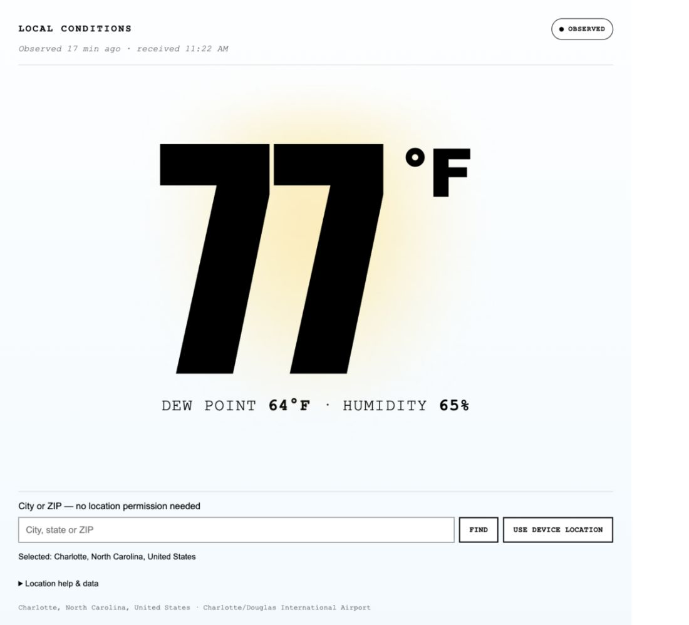

# Temp°

## [Open Temp° — live weather](https://stewalexander-com.github.io/temp/)

[](https://stewalexander-com.github.io/temp/)

Your local weather, large and readable. **[Launch the app](https://stewalexander-com.github.io/temp/)** — no download, account, or setup required.

*The image is an actual app screenshot for Charlotte, NC, not a live weather reading.*

## Use Temp

1. Open **[stewalexander-com.github.io/temp](https://stewalexander-com.github.io/temp/)**.
2. Enter a **city or ZIP**, tap **Find**, and choose your place. Or tap **Use device location** and allow access.
3. Read the temperature, dew point, humidity, and heat index or wind chill when applicable.

After device location loads weather successfully, its button becomes **Refresh**. Tap it to request an updated location and weather reading.

Your selected city is remembered when browser storage is available. Weather updates every 15 minutes while the page is visible, and when you return to it or reconnect. Fresh weather requires internet access; cached readings are labeled.

### Desktop, Facebook, and home screens

City selection works without device-location permission. If an embedded viewer blocks location, use the city search or open the page in your regular browser through the viewer's menu.

For a home-screen shortcut, open the live app in Safari on iPhone or your browser on Android and use its **Add to Home Screen** option where available. Separate browsers and home-screen apps may require choosing your city or granting location permission again.

## What you see

- Large Fahrenheit temperature with a temperature-dependent background.
- Dew point and humidity; heat index or wind chill when applicable.
- Observation or forecast timestamps and clearly labeled older readings.
- Active NWS warnings when available. Alert lookup is supplemental and is not a comprehensive emergency notification service.
- A labeled Open-Meteo model estimate if NWS weather cannot be retrieved.

## Data and privacy

City/ZIP searches go to [Open-Meteo](https://open-meteo.com/) using GeoNames place data. Weather coordinates go to the National Weather Service, with Open-Meteo as a fallback. The app saves your selected place and recent readings in this browser's local storage when available.

## Development

This repository contains the running app. GitHub Pages publishes `docs/` from `main`; there is no application build step.

- `docs/index.html` — interface and metadata.
- `docs/app.js` — location selection, weather, and refresh behavior.
- `docs/styles.css` — responsive presentation.
- `docs/manifest.webmanifest` and icons — home-screen metadata.
- `tests/location-flow.test.mjs` — 23 regression scenarios.

To preview a checkout locally:

```sh
python3 -m http.server 8000 --bind 127.0.0.1 --directory docs
```

Open **http://localhost:8000/**. To run the checks with Node.js:

```sh
node --check docs/app.js
node tests/location-flow.test.mjs
```

See [the RCA and five hardening passes](HARDENING.md) for evidence and testing limits. Desktop browser weather retrieval and responsive rendering were checked; physical Facebook/iPhone and installed home-screen behavior have not been directly verified.

### Project history

[Export notes](EXPORT-NOTES.md) describe the original version-27 export. `Temp-original-source-v27.zip` preserves that earlier server-backed implementation for reference; it is not required to use or run this app. Existing third-party license notices remain in that archive. No new project license is assigned here.

See [sharing and home-screen review](SHARING-REVIEW.md) for the three-pass audit, five-why RCA, and platform verification limits.
